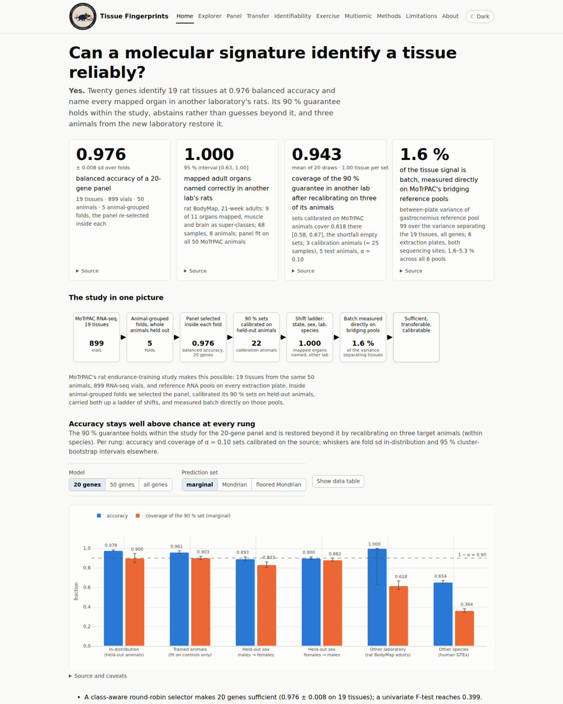

# Molecular Tissue Fingerprints — can a molecular signature identify a tissue reliably?

Submission to the Stanford Bioinformatics Center / MoTrPAC Hackathon (September 2026), track *Molecular Tissue
Fingerprints*. A leakage-safe evaluation pipeline, an interactive site, and an honest answer in three parts.

**Yes, with two qualifications.** A 20-gene panel, selected inside each fold by a class-aware round-robin rule, identifies
19 rat tissues in the MoTrPAC endurance-training transcriptomes at 0.976 ± 0.008 balanced accuracy under animal-grouped
cross-validation, and the panel fit on all animals names every mapped adult organ correctly in another laboratory's rats
(rat BodyMap: 9 of 11 organs have a MoTrPAC counterpart, muscle and brain are scored as super-classes; 68 samples from
8 animals). But "reliably" has three parts and only the first survives on its own. The 90 % conformal guarantee that comes
with the panel does not travel: calibrated on MoTrPAC it covers 0.618 of the BodyMap adults and 0.364 of human GTEx
samples, failing by *abstaining* (empty sets) rather than by confident mistakes; three target animals repair it within
species at one tissue per set, three donors do not repair it across species (11.7 tissues per set). And within a single
multi-tissue study the tissue axis cannot be separated from processing: each tissue sits entirely inside one RNA
extraction plate, one library batch and one flowcell (1 of 171 tissue pairs shares all three, and it is the sex contrast),
so library QC numbers alone classify tissue at 0.975 (0.873 from purely technical ones). Within-study accuracy is
therefore not evidence that the signature is biology; the transfer to an independently processed cohort is, and where
batch could be measured directly, on a reference RNA pool run on six plates at both sites, it was about 1.6 % of the
variance that separates tissues.



## View the site

```bash
python -m http.server -d site 8000        # then open http://localhost:8000
```

No build step. `site/` is plain HTML, CSS and ES-module JavaScript with Plotly.js 2.35.2 (CDN, with a vendored copy for
offline use), and deploys unchanged to GitHub Pages (`.github/workflows/pages.yml`; set the repository URL in
`site/assets/site.js`). Every prediction set in the Explorer is computed in the browser from exported class
probabilities and calibration scores, with the pipeline's own quantile rule.

## Key results

All numbers below are read from `results/` by `scripts/30_export_site_data.py`; the table itself is printed by
`python scripts/30_export_site_data.py --readme-table`. Provenance for every value: `site/data/provenance.json`.

| result | value | source |
|---|---|---|
| 20-gene panel, balanced accuracy (19 tissues, 5 animal-grouped folds) | 0.976 ± 0.008 | `results/05_panels/TRNSCRPT/panel_curve.csv` |
| 50-gene panel / all genes | 0.993 / 0.995 | `results/05_panels/TRNSCRPT/panel_curve.csv, results/04_baselines/TRNSCRPT/summary.csv` |
| F-test selector at k = 20 (why the selector matters) | 0.399 | `results/05_panels/TRNSCRPT/panel_curve_fclassif.csv` |
| Coverage of 90 % sets in-distribution (pooled / one vial per animal) | 0.908 / 0.916 | `results/06_conformal/TRNSCRPT/coverage.csv` |
| BodyMap adults (another lab): accuracy k20 / coverage / empty sets | 1.000 / 0.618 / 0.382 | `results/12_bodymap/` |
| BodyMap recalibrated on 3 animals: coverage at set size | 0.943 at 1.00 | `results/12_bodymap/recalibration.csv` |
| GTEx (human): accuracy k20 / k50 / full | 0.654 / 0.781 / 0.855 | `results/13_gtex/accuracy_overall.csv` |
| GTEx coverage k20 / empty; recalibrated on 3 donors: coverage at set size | 0.364 / 0.616; 0.954 at 11.70 | `results/13_gtex/` |
| Estimable tissue pairs within study (RNA-seq) | 1 of 171 | `results/16_identifiability/estimable_pairs.csv` |
| QC covariates alone: technical / composition / all | 0.873 / 0.949 / 0.975 | `results/16_identifiability/qc_only_summary.csv` |

`figures/summary_figure.png` is the three-panel composite for slides (transfer ladder · stable core · identifiability).

## Repository map

```
site/                    the static site (index, explore, transfer, fingerprint, identifiability, methods, limitations, about)
  data/                  JSON exported from results/ with provenance.json and manifest.json (derived, small; no matrices)
  assets/                theme.css (design tokens), charts.js (Plotly template), site.js (components), conformal.js (the port), pages/
  vendor/                plotly-cartesian-2.35.2.min.js (offline fallback)
src/tfp/                 the library: io, splits (frozen), models, conformal, transfer, batch, discordance, plots, report
scripts/                 numbered phases: 02–14 analysis (06, 08, 12, 13 have --save-scores), 16 identifiability, 30 site export, 32 summary figure
tests/                   leakage / I/O / conformal / batch tests, regeneration checks, site provenance test, JS conformal test
notebooks/               01_replication.ipynb, 02_transfer.ipynb (self-contained), expected_values.csv (288 self-check keys)
docs/                    EVALUATION_RULES (frozen), DATA_GUIDE, NUMBERS_RECONCILIATION, COMPETITION_COMPLIANCE, ABSTRACT_SUBMISSION, BUILD_LOG
tools/                   screenshot.js (render pass with the system Chrome), linkcheck.py
R/                       one-time exports of the MoTrPAC package and the rat BodyMap
results/                 pipeline outputs (git-ignored; reproducible with make); 31_site_regen/ holds the --save-scores reruns
data/                    raw/ (R-package export, 1.9 GB) and external/ (GTEx v8 + BodyMap, 5.8 GB); git-ignored
```

## Reproduce

```bash
conda activate motrpac-py                 # Python 3.12, pandas 3, scikit-learn 1.9; specs in ../../docs/setup/
make test                                 # 51 Python tests + the JS conformal test
make all bodymap gtex                     # phases 02–14 (about 1 h on 20 cores; needs data/)
make identifiability                      # phase 16: batch nesting, estimable pairs, QC-only baseline
make regen-scores                         # phases 06/12/13 with --save-scores into results/31_site_regen (checked against results/)
make site                                 # export site/data with provenance, check the sanity anchors, run the site tests
make screenshots                          # optional render pass (playwright + system Chrome)
```

The evaluation rules every number follows are in `docs/EVALUATION_RULES.md` (frozen): split by animal, everything
data-dependent inside the fold, tuned simple baselines first, per-fold spread and n, calibration on held-out animals,
shift experiments as first-class results, negative results reported.

## Data access

Nothing under `data/` is in the repository.

- **MoTrPAC** rat endurance training, release c1.0 = R package `MotrpacRatTraining6moData` 2.0.0: `make export` runs
  `R/export_motrpac.R` (env `motrpac-r`) and writes `data/raw/` (1.9 GB). The full portal download (~128 GB) is not needed;
  phase 16 reads the consortium RNA-seq QC table from it when present and falls back to the package metadata.
- **Rat BodyMap** GSE53960 via Bioconductor `bodymapRat`: `R/export_bodymap.R` → `data/external/bodymap_*.csv`.
- **GTEx v8** open-access expression and sample attributes (release 2017-06-05): download the three files named in the
  Makefile into `data/external/gtex/`; `scripts/11_gtex_prepare.py` makes the subsets.

## Licence, citation, compliance

Code and site: MIT (`LICENSE`); data keep their own terms. Cite with `CITATION.cff` and the data papers listed there.
Competition compliance (MoTrPAC component, CFDE components GTEx and Metabolomics Workbench PR001020, open source):
`docs/COMPETITION_COMPLIANCE.md`.
