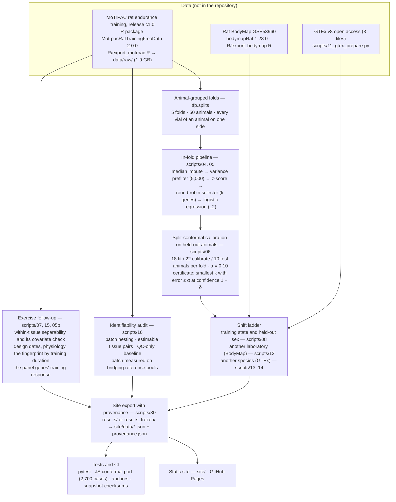

# Molecular Tissue Fingerprints

**A 20-gene panel, its conformal guarantee, and what makes it credible as biology.**

A leakage-safe, calibrated evaluation of compact tissue fingerprints in the MoTrPAC rat multi-tissue transcriptomes,
replicated in an independent laboratory's rats (rat BodyMap) and across species (human GTEx), with a direct measurement
of processing effects on the consortium's bridging standards, an exercise-specific follow-up, and a static site on which
every number carries provenance and whose Explorer scores new samples with the panel in the browser.

[](https://github.com/CoryGardner/motrpac_challenge/actions/workflows/tests.yml)
**Live site:** https://corygardner.github.io/motrpac_challenge/ · **Release:** tag `hackathon-submission-v10.2` (version 2.0.2) · **Licence:** MIT

## Use it

**[Check samples](https://corygardner.github.io/motrpac_challenge/)**: *is this sample the tissue you think it is?* Drop a rat RNA-seq table (the 20 panel genes in
log2 CPM, or a full raw-count matrix in either orientation) with an optional claimed-tissue column. The page returns, per
sample, a tissue call with a calibrated 90 % prediction set, a status (Confident / Ambiguous / Unknown), a claim check
(Consistent / Mismatch / Can't confirm), a gene-level "why X, not Y", its place on a map of the MoTrPAC reference tissues,
and a CSV and printable report. It runs in the browser; nothing is uploaded. "Try the example" loads 80 rat BodyMap
samples from another laboratory with two labels deliberately swapped: both are flagged.

How good the flag is, measured on existing held-out scores at α = 0.10 (`results_product/40_product/flag_rates.csv`,
`scripts/40_product_validation.py`):

| data | samples | correct labels flagged Mismatch | correct labels Can't confirm | swapped labels flagged Mismatch | swaps with ≥ 1 of the pair flagged |
|---|---|---|---|---|---|
| MoTrPAC held-out animals | 899 | 0.9 % | 9.1 % | 91.5 % | 99.8 % |
| rat BodyMap 21-week adults (another lab) | 68 | 0 % | 38.2 % | 62.7 % | 89.2 % |

The scaling guard, measured on the same BodyMap adults (`results_product/40_product/scaling.csv`): the whole mixed set
z-scored together names 100 % of mapped organs (coverage 61.8 %); MoTrPAC reference scaling 98.5 % (coverage 85.3 %, but
unseen thymus is no longer left empty); each organ z-scored alone 4.4 %. So a small or single-tissue upload is never
z-scored within itself. The science behind it is **[The science](https://corygardner.github.io/motrpac_challenge/science.html)**; the per-sample reference data are the
**[Reference atlas](https://corygardner.github.io/motrpac_challenge/explore.html)**.


| | |
|---|---|
| **Team** | The Rat PAC — Erol Evangelista, Cory Gardner, Samuel Montalvo, Manasa Rapuru |
| **Event** | Stanford Bioinformatics Center / MoTrPAC Hackathon, 25–27 September 2026, track *Molecular Tissue Fingerprints* |
| **Intended users** | judges and reviewers; MoTrPAC and CFDE analysts who need a tested harness for tissue classifiers, conformal prediction sets and shift tests; anyone reusing the panels or the evaluation rules |
| **Why it matters** | a signature that transfers to independently processed data, with a calibrated guarantee, is the check that a molecular signature reads biology rather than the processing design of the study it was learned in |

## The answer

**Twenty genes are enough.** Selected inside each animal-grouped fold by a class-aware round-robin rule, a 20-gene
panel identifies 19 rat tissues at 0.976 ± 0.008 balanced accuracy (50 genes 0.993, all genes 0.995). The panel fit on
all animals names every mapped adult organ correctly in another laboratory's rats (rat BodyMap: 9 of 11 organs have a
MoTrPAC counterpart; 68 samples from 8 animals).

**The guarantee travels honestly.** Its 90 % conformal guarantee holds within the study and on trained animals (fit on
the 10 sedentary controls alone, the panel names the tissue of all 40 trained animals at 0.961 with coverage 0.903).
Beyond the study it abstains rather than errs: calibrated on MoTrPAC it covers 0.618 of the BodyMap adults and 0.364 of
human GTEx samples, and the shortfall is empty sets, not confident error. Three animals from the new laboratory restore
observed coverage (0.943 at one tissue per set; 0.86–1.00 per draw, 3 of 20 draws below 0.90). Across species five
donors restore observed coverage of 0.933 at 6.3 tissues per set (every draw finite; 0.67–1.00 per draw); with three
donors 9 of 20 draws have no finite threshold, and the 11 finite draws cover 0.917 at 5.7 tissues per set: the number
returns before the information does, which marks the species boundary honestly. Recalibrated coverage is observed
across draws, not a guarantee for new animals (`results_product/40_product/recal_draws_summary.csv`; Limitations page).

**It is biology, not processing.** Like every large multi-tissue design, this study processed each tissue as a unit, so
within-study accuracy alone cannot say how much of a fingerprint is biology. Two things can: the external replicate,
and MoTrPAC's bridging reference pools, on which batch measured directly is about 1.6 % of the variance that separates
tissues. Training itself barely moves the fingerprint: it is a within-tissue, minor-axis signal, smaller than the tissue
contrast on every panel gene (see the Exercise page).

## Track outputs → where they are

| output the track names | what it is | where |
|---|---|---|
| A classifier | the 20-gene logistic regression with calibrated 90 % prediction sets, applied to your samples | [Check samples](https://corygardner.github.io/motrpac_challenge/) (calls, sets, claim checks, CSV and report); `site/data/panel_model.json` (the model the browser runs); [`src/tfp/models.py`](https://github.com/CoryGardner/motrpac_challenge/blob/main/src/tfp/models.py) |
| Minimal tissue-signature panel | the 20 genes and the 10-gene stable core | [Panel page](https://corygardner.github.io/motrpac_challenge/fingerprint.html); `site/data/panel_card.csv`, `site/data/panel_card.json` |
| Feature-selection workflow | the class-aware round-robin selector, fitted inside animal-grouped folds | [Methods: the selector](https://corygardner.github.io/motrpac_challenge/methods.html#selector); [Explorer panel builder](https://corygardner.github.io/motrpac_challenge/explore.html#panel-builder); [`RoundRobinSelector`](https://github.com/CoryGardner/motrpac_challenge/blob/main/src/tfp/models.py#L58) in `src/tfp/models.py` |
| Interactive model-explanation tool | per sample: probabilities against the calibrated threshold, per-gene contributions ("why X, not Y"), gene values against the reference tissues, a reference map | [Check samples](https://corygardner.github.io/motrpac_challenge/) (the sample drawer); [Reference atlas](https://corygardner.github.io/motrpac_challenge/explore.html): [tissue card](https://corygardner.github.io/motrpac_challenge/explore.html#tissue-card), [gene explorer](https://corygardner.github.io/motrpac_challenge/explore.html#gene-explorer), [panel builder](https://corygardner.github.io/motrpac_challenge/explore.html#panel-builder) |

## Key results

Every number below is read from `results/` by `scripts/30_export_site_data.py` and carries a provenance entry in
`site/data/provenance.json`; the table is the output of `python scripts/30_export_site_data.py --readme-table`.

| result | value | source |
|---|---|---|
| 20-gene panel, balanced accuracy (19 tissues, 5 animal-grouped folds) | 0.976 ± 0.008 | `results/05_panels/TRNSCRPT/panel_curve.csv` |
| 50-gene panel / all genes | 0.993 / 0.995 | `results/05_panels/TRNSCRPT/panel_curve.csv, results/04_baselines/TRNSCRPT/summary.csv` |
| F-test selector at k = 20 (why the selector matters) | 0.399 | `results/05_panels/TRNSCRPT/panel_curve_fclassif.csv` |
| Coverage of 90 % sets in-distribution, all genes (pooled / one vial per animal) | 0.908 / 0.916 | `results/06_conformal/TRNSCRPT/coverage.csv` |
| Coverage of 90 % sets in-distribution, 20-gene panel (pooled / one vial per animal) | 0.900 / 0.924 | `results/31_site_regen/06_conformal/TRNSCRPT/scores_*.csv (recomputed)` |
| Trained animals, panel fit on the sedentary controls only: accuracy k20 / coverage | 0.961 / 0.903 | `results/08_shift/TRNSCRPT/shift_table.csv` |
| BodyMap adults (another lab): accuracy k20 / coverage / empty sets | 1.000 / 0.618 / 0.382 | `results/12_bodymap/` |
| BodyMap recalibrated on 3 animals: coverage at set size | 0.943 at 1.00 | `results/12_bodymap/recalibration.csv` |
| GTEx (human): accuracy k20 / k50 / full | 0.654 / 0.781 / 0.855 | `results/13_gtex/accuracy_overall.csv` |
| GTEx coverage k20 / empty; recalibrated on 3 donors: coverage at set size | 0.364 / 0.616; 0.954 at 11.70 | `results/13_gtex/` |
| Estimable tissue pairs within study (RNA-seq) | 1 of 171 (ovary and testes) | `results/16_identifiability/estimable_pairs.csv` |
| Sedentary vs 8-week-trained within tissue: mean best single-omic AUROC / fusion beats single / attributable to training | 0.994 / 0 of 7 / 4 of 7 | `results/07_fusion/` |
| Trained animals, 8-week group only (cohort-matched with the controls): accuracy k20 / coverage | 0.972 / 0.917 | `results/31_site_regen/08_shift_k20/scores_target_vials.csv` |
| Batch measured on a bridging reference pool run on 6 plates (Σ V_batch / Σ V_tissue, all genes) | 0.016 | `results/16_identifiability/bridge_variance.csv` |
| QC covariates alone, balanced accuracy: technical / composition / all | 0.874 / 0.952 / 0.976 | `results/16_identifiability/qc_only_summary.csv` |


## Research question

**Objective.** Can a compact molecular signature identify a tissue *reliably*, where reliably means: accurate on
held-out animals, calibrated (a 90 % prediction set really covers 90 %), and transferable to independently processed data?

**Scope.** MoTrPAC 6-month rat endurance-training study, portal release c1.0 (rn6), RNA-seq of 19 tissues from the same
50 animals (899 vials, 21,193 genes after the stacked filter; both sexes; sedentary controls and 1, 2, 4 and 8 weeks
of training); proteomics and metabolomics evaluated for within-tissue use only in the core analysis (distributed ratio scale); the
Multiomic follow-up evaluates them across tissues on the portal reporter-ion scale and against external atlases. External: rat BodyMap (316 samples,
11 organs, 4 ages) and GTEx v8 (2,485 samples, 862 donors, 17 tissues, 14,569 one-to-one orthologs present).

**Success criteria.** Balanced accuracy ≥ 0.95 at k ≤ 20 under animal-grouped cross-validation against tuned simple
baselines; in-distribution coverage within 0.02 of the nominal 0.90; every mapped organ of the external replicate
named correctly; every number reproducible from `results/` by tests. All four are met.

## Workflow



Every data-dependent step (imputation, prefilter, scaling, selection, tuning) runs inside the training fold; the
calibration animals are disjoint from the fit and test animals; shift experiments and negative results are
first-class. The rules every phase follows are frozen in `docs/EVALUATION_RULES.md`.

## Quick start (no data needed)

```bash
git clone https://github.com/CoryGardner/motrpac_challenge && cd motrpac_challenge
conda env create -f environment.yml && conda activate tfp      # or: pip install -r requirements.txt
make test          # Python tests (the results-dependent ones read results_frozen/), the JS conformal test, snapshot checksums
make site          # export site/data from results_frozen/, check the sanity anchors, run the site tests
python -m http.server -d site 8000                              # open http://localhost:8000
make smoke         # synthetic data → phases 02, 04, 05, 06 in --quick mode → results_smoke/
```

Expected: pytest ends with every test passed (one comparison against a live `results/` run is skipped when none is present); the JS test prints
`ok: 2713 assertions, 2700 fixture cases (540 with infinite threshold)`; `make site` ends with `all anchors ok`;
`make smoke` ends with `wrote results_smoke/06_conformal/TRNSCRPT` and every banner says the data are synthetic.
A fresh export from the snapshot is byte-identical to the committed `site/data/` apart from its `_meta` block
(`python tools/compare_site_data.py site/data <fresh export dir>`); CI runs exactly this comparison on every push.

## Setup

| environment | file | contents |
|---|---|---|
| Python 3.12 | `environment.yml`, `requirements.txt` | numpy 2.5.3, pandas 3.0.6, scipy 1.18.1, scikit-learn 1.9.1, matplotlib 3.11.2, statsmodels 0.15.0, pyarrow 25.0.0, joblib, pytest 9.1.1 (the versions of the reference run; `pyproject.toml` keeps the lower bounds) |
| R 4.5.3 | `environment-r.yml`, `R/install_deps.R` | data.table 1.18.6.1, jsonlite 2.0.0, remotes, BiocManager (Bioconductor 3.22), SummarizedExperiment, ExperimentHub; `R/install_deps.R` installs `MotrpacRatTraining6moData` at commit `f831a4f` (DESCRIPTION version 2.0.0) and `bodymapRat` 1.28.0 |
| Node 20 | `tools/package.json` | playwright 1.47.2 (only for the render pass and `make figures`; needs a system Chrome) |
| browser | `site/` | Plotly.js 2.35.2 from jsDelivr with a vendored fallback (`site/vendor/`) |

Hardware: the full analysis run took about 45 minutes on a 20-core workstation (phase timings below); `make site`
from the snapshot takes well under a minute; the GTEx preparation reads two 1.6 GB files.

## Data: sources, access and provenance

Nothing under `data/` is in the repository. What the repository holds is derived: `results_frozen/` (the result tables
the site reads, with a sha256 manifest) and `site/data/` (aggregates, per-sample class probabilities and the log2 CPM
of about 100 genes).

| dataset | version | obtained | how | licence |
|---|---|---|---|---|
| MoTrPAC rat 6-month endurance training, portal release c1.0 (rn6) | R package `MotrpacRatTraining6moData` 2.0.0, GitHub commit `f831a4fe421ec11687640452484a8247137aa74a` (tag v2.1.0; the DESCRIPTION reads 2.0.0 at both v2.0.0 and v2.1.0) | 2026-09-17 | `make export` (`R/install_deps.R`, `R/export_motrpac.R` → `data/raw/`, 1.9 GB) | package MIT; consortium data-use terms |
| MoTrPAC portal subset for phase 16 (optional) | Data Hub release c1.0: the RNA-seq QC table and the 19 per-tissue RSEM count files (≈ 165 MB) | — | `MOTRPAC_PORTAL=<dir holding rat-training-06/> make identifiability`; `make portal-check` lists the files (`docs/DATA_GUIDE.md` §9) | consortium data-use terms |
| Rat BodyMap, GEO GSE53960 | Bioconductor `bodymapRat` 1.28.0 (ExperimentHub) | 2026-09-17 | `make bodymap` (`R/export_bodymap.R` → `data/external/bodymap_*.csv`) | CC BY 4.0 |
| GTEx v8 open access (release 2017-06-05, RNASeQCv1.1.9) | gene TPM, gene reads, sample attributes | 2026-09-17 (TPM, attributes), 2026-09-18 (reads) | download the three files below into `data/external/gtex/`, check the checksums, `make gtex` | GTEx data-use policy |
| Rat–human orthologs | `RAT_TO_HUMAN_GENE` as shipped in the MoTrPAC package (one-to-one pairs) | with the package | `data/raw/rat_to_human_gene.csv` | as the package |
| MoTrPAC proteomics reporter-ion files (multiomic follow-up) | Data Hub quant-id folders `rat-training-06/<release>/proteomics-untargeted/<tissue>/prot-pr/` (`motrpac_pass1b-06_<tissue>_prot-pr_rii-results.txt` and `_vial-metadata.txt`, suffix `_v2.0` in c2.0), 7 tissues, releases c1.0 (rn6, main) and c2.0 (rn7, robustness) | 2026-09-26 | `MOTRPAC_QUANT_ID=<dir>`; read by `src/tfp/rii.py` (`scripts/multiomic/01_rii_rescue.py`) | consortium data-use terms |
| Jiang et al. 2020, *Cell* 183:269, [doi:10.1016/j.cell.2020.08.036](https://doi.org/10.1016/j.cell.2020.08.036) (the GTEx tissue proteome, TMT) | supplementary tables S1–S7 (mmc2–mmc8); PRIDE [PXD016999](https://www.ebi.ac.uk/pride/archive/projects/PXD016999) | 2026-09-27 | URLs and sha256 below | journal terms (Elsevier supplementary material) |
| Wang et al. 2019, *Mol Syst Biol* 15:e8503, [doi:10.15252/msb.20188503](https://doi.org/10.15252/msb.20188503) | Tables EV1–EV8 (Europe PMC PMC6379049); PRIDE [PXD010154](https://www.ebi.ac.uk/pride/archive/projects/PXD010154) | 2026-09-27 | URL and sha256 below | CC BY 4.0 |
| Geiger et al. 2013, *Mol Cell Proteomics* 12:1709, [doi:10.1074/mcp.M112.024919](https://doi.org/10.1074/mcp.M112.024919) | supplementary table S1 (mmc1) | 2026-09-27 | URL and sha256 below | journal terms |
| Sato et al. 2022, *Cell Metab* 34:329, [doi:10.1016/j.cmet.2021.12.016](https://doi.org/10.1016/j.cmet.2021.12.016) | supplementary tables mmc2–mmc8 (Metabolon HD4) | 2026-09-27 | URLs and sha256 below | journal terms |
| Metabolomics Workbench [ST003188](https://www.metabolomicsworkbench.org/data/DRCCMetadata.php?Mode=Study&StudyID=ST003188), "A metabolic atlas of mouse aging" (Mullen Lab, USC; project PR001984, [doi:10.21228/M88J0W](https://doi.org/10.21228/M88J0W)) | analysis AN005236 data table, study data and mwTab, released 2025-11-18 | 2026-09-27 | URLs and sha256 below | CC BY 4.0 |

GTEx files (sha256):

```
https://storage.googleapis.com/adult-gtex/bulk-gex/v8/rna-seq/GTEx_Analysis_2017-06-05_v8_RNASeQCv1.1.9_gene_tpm.gct.gz     ec783825ebebb8ba8525b73cb7ff9577162bc0d2e8a7fdc408283b7639c306fb
https://storage.googleapis.com/adult-gtex/bulk-gex/v8/rna-seq/GTEx_Analysis_2017-06-05_v8_RNASeQCv1.1.9_gene_reads.gct.gz   148ab1c84609608a00772b0e1431a1f87d5bf40b63071997510181d0a684a110
https://storage.googleapis.com/adult-gtex/annotations/v8/metadata-files/GTEx_Analysis_v8_Annotations_SampleAttributesDS.txt  74f6ab4c34ed2648d708a0ae6e6dff324f6c86ea723ae7d1c37d76f5221148f0
```

Multiomic follow-up external files (sha256; `results_multiomic/02_discovery/download_log.csv`, which also records sizes
and times):

```
https://ars.els-cdn.com/content/image/1-s2.0-S0092867420310783-mmc1.pdf  430d560ef913f81951642c89b548f8c850e114e8f4d4dccf324d383b92ce9f69
https://ars.els-cdn.com/content/image/1-s2.0-S0092867420310783-mmc2.xlsx  31404e50e86828c09778fc6bb2f6bcea3131b7ebe8f6e647e204f7cdc9c17193
https://ars.els-cdn.com/content/image/1-s2.0-S0092867420310783-mmc3.xlsx  f278d406990059a625cb0d5c4c29e56dd8634052138a38bd053bc0d61124af80
https://ars.els-cdn.com/content/image/1-s2.0-S0092867420310783-mmc4.xlsx  4e816a8ced85c723f5901a6e292f614fb1238e0375419c05237e23d90ff75733
https://ars.els-cdn.com/content/image/1-s2.0-S0092867420310783-mmc5.xlsx  caee46fbee430aef4759c07a951dd2d55848184a0a8f789054ad2ea8b7b710ac
https://ars.els-cdn.com/content/image/1-s2.0-S0092867420310783-mmc6.xlsx  27f42aa61207a810631da861af5d23a826ea261373b60655b0fe80a5f7a328d6
https://ars.els-cdn.com/content/image/1-s2.0-S0092867420310783-mmc7.xlsx  4b9c3040a3c79f44196776739fb7e6dfd54f1c4bbabb4dddcfad15ce87c13d5f
https://ars.els-cdn.com/content/image/1-s2.0-S0092867420310783-mmc8.xlsx  75eb216a16910c1474c7f257f06caeb6ba447e930a77c969e3feee81d128b169
https://ars.els-cdn.com/content/image/1-s2.0-S1550413121006355-mmc2.zip  e801d4c41248fd7062cfc5176f6685634845854a8fd33a8b99120ac822848616
https://ars.els-cdn.com/content/image/1-s2.0-S1550413121006355-mmc3.xlsx  229867c83bf28194fc46b5180bb7b385f9f17b01de583ae2c5a08c9951192b14
https://ars.els-cdn.com/content/image/1-s2.0-S1550413121006355-mmc4.xlsx  558c34e505edc9d3b9130045fd3b3c96874b08c2a080e27eeba7b3c9b2a4fa63
https://ars.els-cdn.com/content/image/1-s2.0-S1550413121006355-mmc5.xlsx  ed09e1de8a8d321771c7d29a91320f1cac7f14348737c184e5b2c93ce5d803d7
https://ars.els-cdn.com/content/image/1-s2.0-S1550413121006355-mmc6.xlsx  b62a234ee601976f678f24a00cb0c42ca337c976aa99ff88954116f022259a19
https://ars.els-cdn.com/content/image/1-s2.0-S1550413121006355-mmc7.xlsx  e5b03bf4b70785cda00cc6c51dbd2686722bb02f5422d96365f0b1daaa8b7675
https://ars.els-cdn.com/content/image/1-s2.0-S1550413121006355-mmc8.xlsx  294da2ddd4c23011259dee6cfa2c7f6e8e5c7d2fb680e88d3ee53804b6dc4631
https://www.metabolomicsworkbench.org/rest/study/analysis_id/AN005236/datatable  b48e92c7f516863b3ea7617ba508aa214e411ecb12952751305fab1cbe6d806a
https://www.metabolomicsworkbench.org/rest/study/study_id/ST003188/data  3d2a87ba7cc5f727ebaac05933d033e63cb6ce4a6242011d5a976b24e09c998e
https://www.metabolomicsworkbench.org/rest/study/study_id/ST003188/mwtab  27bfc8cc41086cb7e34746a6026cfdc0499111649cbf06146ffb95841c873023
https://ars.els-cdn.com/content/image/1-s2.0-S1535947620310860-mmc1.zip  379cc94cbc80b066531e19bb99b79eb23301bf51bf981ef2780d8b96096eb4b5
https://www.ebi.ac.uk/europepmc/webservices/rest/PMC6379049/supplementaryFiles  e954c237408bd687cd9806a07a127840015d1e8a28fab0b971af82ff33bcd5fc
```

Citations: MoTrPAC Study Group, *Nature* 629, 174–183 (2024); Yu et al., *Nat Commun* 5, 3230 (2014); GTEx
Consortium, *Science* 369, 1318–1330 (2020); for the multiomic follow-up, Jiang et al., *Cell* 183, 269–283 (2020);
Wang et al., *Mol Syst Biol* 15, e8503 (2019); Geiger et al., *Mol Cell Proteomics* 12, 1709–1722 (2013); Sato et al.,
*Cell Metab* 34, 329–345 (2022); Metabolomics Workbench study ST003188, doi:10.21228/M88J0W. The data acknowledgement sentence MoTrPAC asks for is in
`docs/DATA_GUIDE.md`.

## Inputs and outputs

| what | where | contract |
|---|---|---|
| phenotypes | `data/raw/pheno.csv` | one row per vial: `viallabel` (11 digits), `bid` = `viallabel[:5]` (one per animal), `pid` (the animal, the unit of every split), `sex`, `group` ∈ {control, 1w, 2w, 4w, 8w}, `tissue`; identifiers are strings |
| sample tables | `data/raw/{norm,counts}/<ASSAY>__<TISSUE>.csv` | features × samples: four leading columns `feature, feature_ID, tissue, assay`, then one column per `viallabel` |
| processing metadata | `data/raw/meta/<ASSAY>.csv` | one row per vial with plate, batch, flowcell, TMT plex and channel |
| external | `data/external/bodymap_{counts,meta}.csv`, `gtex_{tpm,cpm}_subset.csv`, `gtex_meta.csv` | BodyMap: `feature_ID` (ENSRNOG) × 316 samples, meta with organ, sex, stage_weeks, animal_id; GTEx: samples × genes (log2(x + 1)), meta with SAMPID, donor, SMTSD, rat_tissue |
| results | `results/<phase>/*.csv` (git-ignored) and `results_frozen/` (committed) | e.g. `05_panels/TRNSCRPT/panel_curve.csv`: k, fold, balanced_accuracy, n_train_animals, n_test_animals; `06_conformal/TRNSCRPT/coverage.csv`: calibration, conformal, alpha, coverage, frac_empty, avg_set_size; `08_shift/TRNSCRPT/shift_table.csv`: split, arm, accuracy_all, coverage_target_seen, …; `31_site_regen/*/scores_*.csv`: per-sample class probabilities and calibration scores |
| site data | `site/data/*.json` | `headline.json` (tiles, ladder rows, extras, design constants), `exercise.json`, `provenance.json` (one entry per number: file, row selector, column, aggregation, tolerance), `manifest.json` (the files read, with sha256; versions; data access dates), `samples_*.json`, `conformal_fixtures.json` |
| figures | `figures/summary_figure.png`, `figures/home.png` | `make figures` (the first needs no data; the second renders the site) |

The full layout and the identifier conventions are in `docs/DATA_GUIDE.md`.

## Methods and provenance

| step | where | what |
|---|---|---|
| splitting | `src/tfp/splits.py` (frozen) | `StratifiedGroupKFold` on `pid`; leave-one-sex-out; train on controls, test on trained; fit/calibration split of the training animals |
| models | `src/tfp/models.py` | `RoundRobinSelector` (the best remaining gene of each tissue in turn, by one-vs-rest effect size); L2 logistic regression, C tuned by an inner animal-grouped grid search; tuned baselines (nearest centroid, L1/L2 logistic regression, random forest) on the same folds |
| conformal sets | `src/tfp/conformal.py` | split conformal (LAC and APS): the ⌈(n+1)(1−α)⌉-th smallest calibration score, +∞ when that rank exceeds n; Mondrian and floored variants; Clopper–Pearson certificate with fixed-sequence testing; the same rule is ported to the browser in `site/assets/conformal.js` and tested against 2,700 Python-computed cases |
| transfer | `src/tfp/transfer.py` | z-scores within dataset; super-classes for muscle and brain; recalibration on 3 or 5 target individuals over 20 draws |
| identifiability | `src/tfp/batch.py`, `scripts/16_identifiability.py` | Cramér's V, estimable tissue pairs, a QC-only multinomial classifier, and the between-plate variance of the reference-standard RNA pools relative to the variance of the tissue means |
| exercise follow-up | `scripts/07_*`, `scripts/15_*`, `scripts/05_panel_training_response.py` | sedentary vs trained within tissue (13 arms, permutation null, covariate-only classifiers), the design dates and physiology, the fingerprint by training duration, the panel genes' training response |
| provenance | `scripts/30_export_site_data.py` | no number on the site is typed by hand; `provenance.json` records the file, row, column and aggregation of each; `tests/test_site_data.py` re-reads every entry from the results; sanity anchors stop the export when a headline number moves |

External code: scikit-learn, pandas, numpy, scipy, matplotlib (Python); `bodymapRat`, `MotrpacRatTraining6moData`
(R); Plotly.js 2.35.2 (MIT, `site/vendor/LICENSE.plotly.txt`). AI tools assisted with code and writing; all results
were verified by the team.

## Validation

| check | command | expected |
|---|---|---|
| unit, leakage and I/O tests; snapshot; site provenance | `make test` | every test passed; `verify-frozen` prints `ok` |
| JS conformal port against Python | `node tests/test_site_conformal.js` | `ok: 2713 assertions, 2700 fixture cases (540 with infinite threshold)` |
| the browser scoring tool against the pipeline's BodyMap scores, and its example recalibration | `node tests/test_score_tool.js` | `ok: 976 assertions over 316 BodyMap samples; max \|Δp\| = 2.59e-4` … `ok: 1075 assertions in all` |
| every site number against the result files | `PYTHONPATH=src pytest -q tests/test_site_data.py` | passed (runs from `results/` or `results_frozen/`) |
| regeneration reproduces the published tables cell for cell | `PYTHONPATH=src pytest -q tests/test_regen_scores.py` | passed |
| sanity anchors of the headline numbers | `make site-data` | `all anchors ok` |
| expected outputs | export from `results_frozen/` and `python tools/compare_site_data.py site/data <dir>` | `identical apart from _meta` |
| no-data smoke run | `make smoke` | four phases write `results_smoke/`; banners say the data are synthetic |
| render pass | `make screenshots` (Chrome + playwright) | `all page renders clean` in both themes at 1440, 1024 and 390 px |

Known failure modes and limits (details on the site's Limitations page):

- with fewer than 9 calibration scores in a class at α = 0.10, the Mondrian threshold is +∞ and the set holds every tissue;
- 45 % of the three-donor GTEx recalibration draws have no finite threshold, so the recalibrated GTEx coverage must be read with its set size;
- juvenile BodyMap testes and spleen are misnamed by single developmental markers (Pgk2, Hbq1b); the panel is an adult fingerprint;
- 7 of the 20 panel genes have no BodyMap organ and are untested within species; Artery–Aorta → vena cava is an imperfect human mapping;
- the transcript gene filter runs before the split (the one known deviation from the frozen rules);
- sex is confounded with arrival cohort, and only the 8-week animals share sacrifice dates with the controls;
- without the portal subset, phase 16 uses the package metadata for the QC baseline and reports the bridging measurement as pending;
- BodyMap animal identifiers are inferred from the replicate index (GEO carries none).

## Reuse

- **Licence:** MIT for code, site and derived tables (`LICENSE`); the data keep their own terms (table above).
- **Cite:** `CITATION.cff` (version 2.0.2, tag `hackathon-submission-v10.2`), the three data papers, and the multiomic sources in the Data section.
- **Score your samples:** the Explorer's *Score your own samples* tool takes a CSV of log2 CPM for the 20 panel genes
  (a template is provided) and returns tissue calls and 90 % prediction sets in the browser, with optional recalibration
  on labelled samples; the panel card (`site/data/panel_card.csv`, `.json`) lists the genes with their mean expression per
  tissue, and `site/data/panel_model.json` holds the coefficients (`scripts/34_panel_model.py`, `make panel-model`).
- **Extend:** the library is `src/tfp/`; a new phase is a numbered script with a Makefile target; if the site shows its
  numbers, add provenance entries in `scripts/30_export_site_data.py` and re-freeze (`make freeze-results`).
- **Extras:** `extras/` holds analyses outside the submission path (discordance, the report builder, the GEO fallback,
  the time-course investigations, the frozen replication notebooks); not covered by the tests.
- **Roadmap:** rerun on portal release c2.0 (rn7); a rat multi-tissue proteome to replicate the protein fingerprint externally (none is public); MoTrPAC human tissues when
  released; exercise-response panels under the same rules; further independently processed rat cohorts.
- **Follow-up, the proteome and metabolome (pre-registered, run after the core analysis):** the proteome and metabolome carry the
  fingerprint too, on the right scale. On the portal's reporter-ion intensities tissue explains R² 0.991 of PC1 against
  0.0009 on the distributed ratios (`results_multiomic/01_rii/variance_partition.csv`, `variance_partition_ratio.csv`); a
  20-protein panel selected there names the tissue of 0.455 of 44 human TMT samples from 13 GTEx donors (donor-bootstrap
  95 % CI 0.36–0.55; 0.734 of 94 samples when both sides are processed the same way; `results_multiomic/03_prot_transfer/
  accuracy_overall.csv`, `rawppm/accuracy_overall.csv`), with coverage 0.068 under MoTrPAC calibration and 0.917 after
  recalibrating on five donors at 2.95 of 7 classes per set (`recalibration.csv`); and in Jiang 2020's TMT design 424 of
  528 tissue pairs share a run (`results_multiomic/06_external_identifiability/design_comparison.csv`), the counterexample
  the audit lacked. Page: `site/multiomic.html`; report: `docs/MULTIOMIC_REPORT.md`; pre-registration:
  `docs/PREREGISTRATION_MULTIOMIC.md`. Within-study numbers there are context (plex is nested in tissue on that scale too).
- **History:** `CHANGELOG.md`.

## Example runs

No data: the quick start above, plus `make figures` (Chrome + playwright) and
`python scripts/30_export_site_data.py --readme-table` for the key-results table.

Full run:

```bash
conda env create -f environment-r.yml && conda activate tfp-r && Rscript R/install_deps.R
make export                                     # the MoTrPAC package → data/raw (1.9 GB, ~15 min)
Rscript R/export_bodymap.R data/external 100    # rat BodyMap counts
# download the three GTEx files into data/external/gtex/ and check the sha256 (Data section)
conda activate tfp
make check all external                         # phases 02–08, 11–14: about 45 min on 20 cores
MOTRPAC_PORTAL=/path/to/portal make identifiability   # phase 16 (bridge needs the portal subset)
make time-course panel-training                 # phase 15 and the panel genes' training response
make regen-scores                               # per-sample score reruns of phases 06, 08, 12, 13
make site freeze-results figures                # export, tests, refresh results_frozen/, figures
```

Phase timings of the reference run (2026-09-18, 20 cores): baselines 196 s, panels 389 s, conformal 525 s, fusion
1,559 s, shift 89 s, bodymap 155 s, gtex 541 s.

## Repository map

```
site/                 the static site: index, exercise, explore, transfer, fingerprint, identifiability, methods, limitations, about
  data/               JSON exported from the results, with provenance.json and manifest.json
  assets/             theme.css, charts.js, site.js, conformal.js (the port), ladder.js, overview.js, pages/, brand/
src/tfp/              the library: config, io, splits (frozen), models, conformal, transfer, batch, plots, report, cli
scripts/              numbered phases 02–16 (07, 15, 05b feed the Exercise page), 30 site export, 32 summary figure, 33 freeze
results_frozen/       the result files the site reads, with MANIFEST.json (sha256)
tests/                leakage, I/O, conformal, batch, config, regeneration, snapshot, site provenance; the JS conformal test
docs/                 EVALUATION_RULES (frozen), DATA_GUIDE, EXTERNAL_VALIDATION, GTEX_TRANSFER, ABSTRACT_SUBMISSION,
                      COMPETITION_COMPLIANCE, NUMBERS_RECONCILIATION + reconciliation/ (what moved when the conformal rule was corrected before release)
tools/                linkcheck.py, screenshot.js, compare_site_data.py, make_logo_assets.py
R/                    install_deps.R, export_motrpac.R, export_bodymap.R
figures/              summary_figure.png, home.png
branding/             the team logo source
extras/               analyses outside the submission path (see extras/README.md)
results/, data/       git-ignored: pipeline outputs, the data export and the external downloads
```
