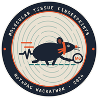
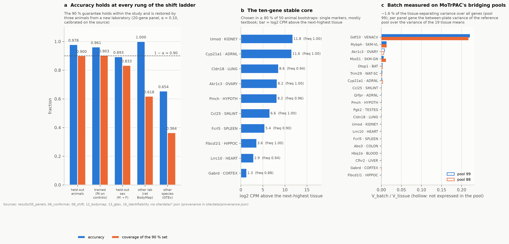

# Molecular Tissue Fingerprints

*The Rat PAC · Stanford Multi-omics Hackathon 2026, Track 3*

**A 20-gene panel, its conformal guarantee, and what makes it credible as biology.**

A leakage-safe, calibrated evaluation of compact tissue fingerprints in the MoTrPAC rat multi-tissue transcriptomes,
replicated in an independent laboratory's rats (rat BodyMap) and across species (human GTEx), with a direct measurement
of processing effects on the consortium's bridging standards, an exercise-specific follow-up, and a static site on which
every number carries provenance and whose Check samples page scores new samples in the browser.

[](https://github.com/Stanford-Bioinformatics-Center/multiomics-hackathon-2026-track-3/actions/workflows/tests.yml)
**Repository:** https://github.com/Stanford-Bioinformatics-Center/multiomics-hackathon-2026-track-3
**Site** (GitHub Pages, organization members): https://turbo-guide-2yve4kz.pages.github.io/ · **Release:** tag `hackathon-submission-v10.3.3` (version 2.1.3) · **Licence:** MIT (`LICENSE`); third-party data and their terms: [`NOTICE.md`](NOTICE.md)

## The Track 3 brief

*Can molecular signatures identify a tissue reliably?* (the organizers' brief, Stanford Multi-omics Hackathon 2026, Track 3,
Molecular Tissue Fingerprints)

- **Challenge:** use one or more omics layers to predict tissue identity and determine whether a compact, interpretable
  signature is sufficient.
- **Data:** individual-sample rat endurance-training data across a selected set of tissues, with GTEx or another tissue
  resource for external context.
- **Potential outputs:** a classifier; a minimal tissue-signature panel; a feature-selection workflow; an interactive
  model-explanation tool.
- **Important:** evaluation must prevent animal-level data leakage and compare performance with simple baselines.

### How we meet it

<!-- BEGIN generated:how -->
- **No animal-level leakage.** Whole animals are held out in 5 animal-grouped folds (40 training and 10 test animals per fold); every data-dependent step (imputation, variance prefilter, gene selection, scaling, tuning) is fit inside the fold, and the 22 calibration animals of the prediction sets are disjoint from the fit and test animals (`docs/EVALUATION_RULES.md`, `src/tfp/splits.py`).
- **Simple baselines on the same folds.** All-gene nearest centroid 0.982, L2 logistic regression 0.995 and random forest 0.993 balanced accuracy, against 0.976 for the 20-gene panel; a univariate F-test selector at the same 20 genes reaches 0.399, which is why the class-aware selector matters.
- **The four outputs.** Each is mapped to where it lives in [Track outputs](#track-outputs--where-they-are).
<!-- END generated:how -->

## Use it

<!-- BEGIN generated:useit -->
**[Check samples](https://turbo-guide-2yve4kz.pages.github.io/)**: *is this sample the tissue you think it is?* Drop in a rat RNA-seq table (the 20 panel genes in log2 CPM, or a full raw-count matrix) with an optional claimed-tissue column; for every sample the page returns a tissue call, its 90 % prediction set (the tissues the model cannot rule out), the genes behind the call, and a flag when the label does not fit. It runs in the browser; nothing is uploaded. “Try the example” loads 80 rat BodyMap samples from another laboratory with two labels deliberately swapped: both are flagged.

How good the flag is, at α = 0.10, on existing held-out scores (`results_product/40_product/flag_rates.csv`):

| data | samples | correct labels flagged Mismatch | correct labels Can't confirm | swapped labels flagged Mismatch | swaps with ≥ 1 of the pair flagged |
|---|---|---|---|---|---|
| MoTrPAC held-out animals | 899 | 0.9 % | 9.1 % | 91.5 % | 99.8 % |
| rat BodyMap 21-week adults (another lab) | 68 | 0.0 % | 38.2 % | 62.6 % | 89.2 % |

A small or single-tissue upload is never z-scored within itself: on the same BodyMap adults, scaling each organ alone names 4.4 % of mapped organs, against 100 % for the whole mixed set and 98.5 % with MoTrPAC reference scaling (`results_product/40_product/scaling.csv`).
<!-- END generated:useit -->

The science behind it is on **[The science](https://turbo-guide-2yve4kz.pages.github.io/science.html)**; the
per-sample reference data are in the **[Reference atlas](https://turbo-guide-2yve4kz.pages.github.io/explore.html)**.


| | |
|---|---|
| **Event** | Stanford Bioinformatics Center / MoTrPAC Hackathon, 25–27 September 2026, track *Molecular Tissue Fingerprints* |
| **Intended users** | judges and reviewers; MoTrPAC and CFDE analysts who need a tested harness for tissue classifiers, conformal prediction sets and shift tests; anyone reusing the panels or the evaluation rules |
| **Why it matters** | a signature that transfers to independently processed data, with a calibrated guarantee, is the check that a molecular signature reads biology rather than the processing design of the study it was learned in |

## The answer

<!-- BEGIN generated:answer -->
**20 genes are enough.** Selected inside each animal-grouped fold by a class-aware round-robin rule, a 20-gene panel identifies 19 rat tissues at 0.976 ± 0.008 balanced accuracy (50 genes 0.993, all genes 0.995). The panel fit on all animals names every mapped adult organ correctly in another laboratory's rats (rat BodyMap: 9 of 11 organs have a MoTrPAC counterpart; 68 samples from 8 animals).

**The guarantee holds in the study; coverage travels honestly.** The 90 % conformal guarantee holds within the study and on trained animals (fit on the 10 sedentary controls alone, the panel names the tissue of all 40 trained animals at 0.961 with coverage 0.903). Beyond the study it abstains rather than errs: calibrated on MoTrPAC it covers 0.618 of the BodyMap adults and 0.364 of human GTEx samples, and the shortfall is empty sets, not confident error. 3 animals from the new laboratory restore observed coverage (0.943; 0.86–1.00 per draw); across species 5 donors restore observed coverage of 0.933 at 6.3 tissues per set, while with 3 donors 9 of 20 draws have no finite threshold: the number returns before the information does. Recalibrated coverage is observed across draws, not a guarantee for new animals.

**It is biology, not processing.** Like every large multi-tissue design, this study processed each tissue as a unit, so within-study accuracy alone cannot say how much of a fingerprint is biology. Two things can: the external replicate, and MoTrPAC's bridging reference pools, on which batch measured directly is 1.6 %–5.3 % of the variance that separates tissues across the 6 pools. Training itself barely moves the fingerprint (see the Exercise page).

**Proteins and metabolites carry the tissue axis too, more weakly.** On the portal's reporter-ion intensities tissue explains R² 0.991 of the first proteomics component (0.0009 on the distributed ratios, which are built to remove it); a 20-protein panel names the tissue of 0.455 of 44 human samples from another laboratory (chance 0.143), below RNA on the same 42 samples (0.476 vs 1.000), and fusing the two does not help (0.738). A 20-metabolite panel names the organ of 0.637 of mouse samples (chance 0.111). The core fingerprint is RNA ([Multiomic page](https://turbo-guide-2yve4kz.pages.github.io/multiomic.html)).
<!-- END generated:answer -->

## Track outputs → where they are

<!-- BEGIN generated:outputs -->
| output the track names | what it is | where |
|---|---|---|
| A classifier | the 20-gene logistic regression with 90 % conformal prediction sets, applied to your samples | [Check samples](https://turbo-guide-2yve4kz.pages.github.io/) (calls, sets, claim checks, CSV and report); `site/data/panel_model.json` (the model the browser runs); [`src/tfp/models.py`](src/tfp/models.py) |
| Minimal tissue-signature panel | the 20 genes and the 10-gene stable core | [Panel page](https://turbo-guide-2yve4kz.pages.github.io/fingerprint.html); `site/data/panel_card.csv`, `site/data/panel_card.json` |
| Feature-selection workflow | the class-aware round-robin selector, fitted inside animal-grouped folds | [Methods: the selector](https://turbo-guide-2yve4kz.pages.github.io/methods.html#selector); [Reference atlas: panel builder](https://turbo-guide-2yve4kz.pages.github.io/explore.html#panel-builder); [`RoundRobinSelector`](src/tfp/models.py#L58) in `src/tfp/models.py` |
| Interactive model-explanation tool | per sample: probabilities against the calibrated threshold, per-gene contributions (“why X, not Y”), gene values against the reference tissues, a reference map | [Check samples](https://turbo-guide-2yve4kz.pages.github.io/) (the sample drawer); [Reference atlas](https://turbo-guide-2yve4kz.pages.github.io/explore.html): [tissue card](https://turbo-guide-2yve4kz.pages.github.io/explore.html#tissue-card), [gene explorer](https://turbo-guide-2yve4kz.pages.github.io/explore.html#gene-explorer), [panel builder](https://turbo-guide-2yve4kz.pages.github.io/explore.html#panel-builder) |
<!-- END generated:outputs -->

## Team: The Rat PAC

- Cory Gardner (team lead): the analysis pipeline and the evaluation design (animal-grouped folds, the round-robin panel selector, conformal prediction sets, the shift ladder with the rat BodyMap and GTEx transfers, the batch audit on MoTrPAC's bridging reference pools); the tested repository, provenance and site build.
- Samuel Montalvo: product and visual design (the Check samples interface and the interactive explorer); the exercise analysis (training effects on the panel, VO2max and body composition).
- Manasa Rapuru: the multi-omic follow-up (the proteomics reporter-ion rescue, the protein and metabolite transfers to the GTEx proteome and Metabolomics Workbench) and its pre-registration.
- Erol Evangelista (writer): the README and documentation, the site's text and glossary, the slides and the speaking script; the marker-gene interpretation.
- All four: the study design, review of every result against the evaluation rules frozen on day one (docs/EVALUATION_RULES.md), and the presentation.

AI tools assisted with code and writing; all results were verified by the team.

## Key results

Every number below is read from `results/` by `scripts/30_export_site_data.py` and carries a provenance entry in
`site/data/provenance.json`; the table is the output of `python scripts/30_export_site_data.py --readme-table`.

<!-- BEGIN generated:keyresults -->
| result | value | source |
|---|---|---|
| 20-gene panel, balanced accuracy (19 tissues, 5 animal-grouped folds) | 0.976 ± 0.008 | `results/05_panels/TRNSCRPT/panel_curve.csv` |
| 50-gene panel / all genes | 0.993 / 0.995 | `results/05_panels/TRNSCRPT/panel_curve.csv, results/04_baselines/TRNSCRPT/summary.csv` |
| F-test selector at k = 20 (why the selector matters) | 0.399 | `results/05_panels/TRNSCRPT/panel_curve_fclassif.csv` |
| All-gene simple baselines on the same folds, balanced accuracy: nearest centroid / L2 logistic regression / random forest | 0.982 / 0.995 / 0.993 | `results/04_baselines/TRNSCRPT/summary.csv` |
| Coverage of 90 % sets in-distribution, all genes (pooled / one vial per animal) | 0.908 / 0.916 | `results/06_conformal/TRNSCRPT/coverage.csv` |
| Coverage of 90 % sets in-distribution, 20-gene panel (pooled / one vial per animal) | 0.900 / 0.924 | `results/31_site_regen/06_conformal/TRNSCRPT/scores_*.csv (recomputed)` |
| Trained animals, panel fit on the sedentary controls only: accuracy k20 / coverage | 0.961 / 0.903 | `results/08_shift/TRNSCRPT/shift_table.csv` |
| BodyMap adults (another lab): accuracy k20 / coverage / empty sets | 1.000 / 0.618 / 0.382 | `results/12_bodymap/` |
| BodyMap recalibrated on 3 animals: coverage at set size | 0.943 at 1.00 | `results/12_bodymap/recalibration.csv` |
| GTEx (human): accuracy k20 / k50 / full | 0.654 / 0.781 / 0.855 | `results/13_gtex/accuracy_overall.csv` |
| GTEx coverage k20 / empty; recalibrated on 3 donors (all 20 draws, 9 with no finite threshold): coverage at set size | 0.364 / 0.616; 0.954 at 11.70 | `results/13_gtex/` |
| Estimable tissue pairs within study (RNA-seq) | 1 of 171 (ovary and testes) | `results/16_identifiability/estimable_pairs.csv` |
| Sedentary vs 8-week-trained within tissue: mean best single-omic AUROC / fusion beats single / attributable to training | 0.994 / 0 of 7 / 4 of 7 | `results/07_fusion/` |
| Trained animals, 8-week group only (cohort-matched with the controls): accuracy k20 / coverage | 0.972 / 0.917 | `results/31_site_regen/08_shift_k20/scores_target_vials.csv` |
| Batch measured on a bridging reference pool run on 6 plates (Σ V_batch / Σ V_tissue, all genes) | 0.016 | `results/16_identifiability/bridge_variance.csv` |
| QC covariates alone, balanced accuracy: technical / composition / all | 0.874 / 0.952 / 0.976 | `results/16_identifiability/qc_only_summary.csv` |
<!-- END generated:keyresults -->

The `results/…` sources are the live pipeline outputs (git-ignored); the same relative paths are committed under
`results_frozen/` (for example `results_frozen/05_panels/TRNSCRPT/panel_curve.csv`).



## Known failure modes

- Within MoTrPAC each tissue was processed as one batch, so within-study accuracy cannot separate tissue from batch; the external laboratory and the bridging pools do.
- In another laboratory most prediction sets start empty (the model abstains) until the threshold is recalibrated on a few of your own labelled samples; recalibrated coverage is observed, not guaranteed.
- Across species (human GTEx) accuracy drops and recalibration restores the coverage number before it restores informative sets.
- A small or single-tissue upload is scored with MoTrPAC reference scaling, which does not abstain on organs the model never saw.
- Proteomics as distributed (ratios to per-tissue pools) cannot carry tissue identity; the full list is on the [Limitations page](https://turbo-guide-2yve4kz.pages.github.io/limitations.html).

## Reproduce

The data are not in the repository. [docs/REPRODUCIBILITY.md](docs/REPRODUCIBILITY.md) has the setup (pinned environments),
every data source with its version, access date, download URL and sha256, the inputs and outputs, the methods and where
they live in the code, the validation checks with their expected output, the full run with phase timings, and the
repository map. Third-party data committed here and their licences: [NOTICE.md](NOTICE.md).

## Quick start (no data needed)

```bash
git clone https://github.com/Stanford-Bioinformatics-Center/multiomics-hackathon-2026-track-3 tfp && cd tfp
conda env create -f environment.yml && conda activate tfp      # or: pip install -r requirements.txt
make test          # Python tests (the results-dependent ones read results_frozen/), the JS conformal test, snapshot checksums
make site          # export site/data from results_frozen/, check the sanity anchors, run the site tests
python -m http.server -d site 8000                              # open http://localhost:8000
make smoke         # synthetic data → phases 02, 04, 05, 06 in --quick mode → results_smoke/
```

Expected: every test passes (one comparison against a live `results/` run is skipped when none is present), `make site`
ends with `all anchors ok`, and every smoke-run banner says the data are synthetic. The exact expected outputs of every
check are in [docs/REPRODUCIBILITY.md](docs/REPRODUCIBILITY.md#validation).

## Cite

`CITATION.cff` (version 2.1.3, tag `hackathon-submission-v10.3.3`), and the data: MoTrPAC Study Group, *Nature* 629,
174–183 (2024); Yu et al., *Nat Commun* 5, 3230 (2014); GTEx Consortium, *Science* 369, 1318–1330 (2020); for the
multiomic follow-up the sources listed in [NOTICE.md](NOTICE.md). History: [CHANGELOG.md](CHANGELOG.md).
